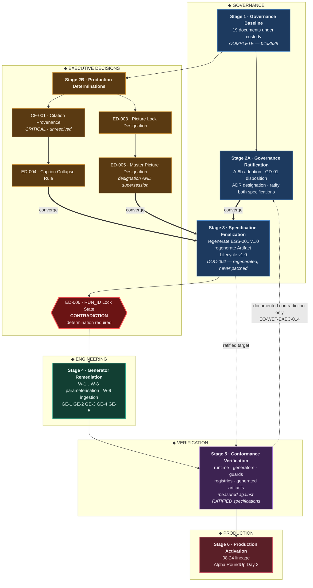

# PROGRAM DEPENDENCY DIAGRAM — Rev A

**Issued under:** EXECUTIVE ORDER `EO-WET-EXEC-017A` — Program Dependency Clarification, Executive Producer / Chairman, 2026-08-30
**Supersedes:** `PROGRAM_DEPENDENCY_DIAGRAM.md` (original, `EO-WET-EXEC-017` Deliverable 5)
**Prepared by:** Governance Compliance Auditor · **Custody:** `MACHINE` · **Authority:** NONE
**Repository:** READ ONLY at `b4d8529` · **Implementation:** NOT AUTHORIZED · **Commits:** none

> **This revision clarifies execution dependencies only.** No architecture changed. No stage was added or removed. `EO-WET-EXEC-014`'s freeze is intact.

---

# 0 · THE DISTINCTION THIS REVISION ENCODES

> **Independent in authority. Partially ordered in execution.** — `EO-WET-EXEC-017A`

**Neither stage derives its authority from the other**, and the graph carries **no edge between them**. **Both converge before Specification Finalization**, because engineering downstream cannot begin while either is open.

| | Stage 2A | Stage 2B |
|---|---|---|
| question answered | *are the governing documents approved?* | *what is the production truth?* |
| authority source | its own — not 2B | its own — not 2A |
| lane | **GOVERNANCE** | **EXECUTIVE DECISIONS** |
| edge to the other | **none** | **none** |

---

# 1 · EXECUTION FLOW BY LANE



**Bold edges are the convergence.** `S2A` and the terminal determinations of `S2B` both enter Specification Finalization, and there is no edge in either direction between the two stages.

---

# 2 · WHAT CHANGED FROM THE ORIGINAL

| # | `EO-WET-EXEC-017A` directive | change |
|---|---|---|
| 1 | Revise the dependency diagram | **done** — this is Rev A |
| 2 | 2A and 2B shown as parallel Executive workstreams | **done** — same rank, both fed only by Stage 1 |
| 3 | Both converge before Specification Finalization | **done** — `S2A ⇒ S3` added; `ED-004 ⇒ S3` and `ED-005 ⇒ S3` added |
| 4 | No direct dependency arrow between 2A and 2B | **done** — none exists in either direction |
| 5 | Generator Remediation depends on both 2B and Specification Finalization | **done** — via the convergence at `S3`; §3 |
| 6 | No architecture changes | **none** |
| 7 | No stages added or removed | **six stages, unchanged** |

**Removed from the original:** the direct edges `ED-004 → W-9` and `ED-005 → W-9`, which bypassed Specification Finalization. **`W-9` is now shown inside Stage 4 rather than as a separate node**, since the 2B dependencies it carried are satisfied upstream at the convergence. **This is a re-routing of edges, not a change of scope** — the work items in `GENERATOR_REMEDIATION_PLAN.md` are unchanged.

---

# 3 · DIRECTIVE 5, AND HOW IT IS SATISFIED

> *"Generator Remediation shall depend on the completion of both Stage 2B and Specification Finalization."*

**Both dependencies hold, one directly and one through the convergence:**

```
Stage 2B  ──▶ Specification Finalization ──▶ ED-006 ──▶ Stage 4
Stage 2A  ──▶ Specification Finalization ──▶ ED-006 ──▶ Stage 4
```

**No redundant `2B → Stage 4` edge is drawn.** With directive 3 in force, `S3` already requires `2B`, so a direct edge would be transitively implied and would add nothing but clutter. **The dependency is real and enforced; it is carried by the path rather than duplicated.** If you want it drawn explicitly for emphasis, that is one edge and I will add it.

---

# 4 · TWO ITEMS FLAGGED RATHER THAN DECIDED

## 4.1 · `ED-006` is retained as a gate

**Directive 5 names two dependencies for Stage 4. `ED-006` is a third.** It is retained because it is an open, documented contradiction — one `RUN_ID` lock instrument recorded in two states — and removing it would take a live governance conflict out of the execution graph.

**It is not a stage**, so retaining it does not violate directive 7. **It is drawn as a gate on the edge into Stage 4. Remove it on direction.** `[O]`

## 4.2 · Convergence at `S3` is a scheduling constraint, not an input dependency

**Your own distinction applies one level down, and it is worth recording.**

**Nothing in Specification Finalization consumes a Stage 2B output.** Regenerating `EGS-001` v1.0 takes four inputs — the v0.2 source, the ratified redline, the adopted `A-8b` text and the confirmed designation — and **all four come from Stage 2A.** `CF-001`, `ED-003`, `ED-004` and `ED-005` feed the *generator*, not the *specification*.

**So `2B ⇒ S3` orders execution; it does not supply an input.** That is a defensible and probably desirable choice — it means no engineering begins until every Executive determination is closed, which is the discipline the whole roadmap exists to enforce. **It is recorded as chosen rather than derived, so that a later reader does not mistake it for a data dependency and conclude that v1.0 somehow depends on the caption collapse rule.** `[E]`

---

# 5 · LANE LEGEND

| lane | contains | who acts |
|---|---|---|
| ◆ **GOVERNANCE** | baseline custody · ratification · specification regeneration | Executive act on the governance corpus |
| ◆ **EXECUTIVE DECISIONS** | production truth · the lock determination | Executive only — never inferred by the platform |
| ◆ **ENGINEERING** | generator remediation · ingestion readiness | engineering — **unauthorized until separately approved** |
| ◆ **VERIFICATION** | conformance to the ratified specifications | measurement only — no redesign |
| ◆ **PRODUCTION** | governed processing of the 08-24 lineage and Day 3 | gated on all five predecessors |

**Stage 2A and Stage 2B are both Executive workstreams and are held in different lanes on purpose** — 2A approves governing documents, 2B determines production truth. **The lane separation is the diagram's expression of your distinction, and the absent edge is its expression of independent authority.**

---

# 6 · EDGES THAT CARRY MEANING

| edge | why |
|---|---|
| `S1 → S2A` · `S1 → S2B` | two independent successors of the committed baseline |
| **(no edge 2A ↔ 2B)** | **independent authority** — `EO-017A` directive 4 |
| `CF-001 → ED-004` | the collapse rule cannot be set while the authoritative caption stream is unidentified `[E]` |
| `ED-003 → ED-005` | the master picture depends on the picture lock, and is also a supersession — `CAM-002` §3.2 `[E]` |
| `S2A ⇒ S3` · `ED-004 ⇒ S3` · `ED-005 ⇒ S3` | **convergent execution** — `EO-017A` directive 3 |
| `S3 → ED-006 → S4` | remediation waits on ratified specifications **and** the lock determination |
| `S3 ⇢ S5` | conformance is measured against the **ratified** specifications, not the certified baseline |
| `S5 ⇢ S2A` | **the only backward edge.** *"Only documented contradictions may reopen design."* Narrow, governed |

---

# 7 · CRITICAL PATH

```
CF-001 ──▶ ED-004 ──┐
ED-003 ──▶ ED-005 ──┤
                    ├──▶ Spec Finalization ──▶ ED-006 ──▶ Stage 4 ──▶ Stage 5 ──▶ Stage 6
GD-01 ──▶ ADR-012 ──┘
   └──▶ ratify EGS-001 + Lifecycle
```

**Three heads, all Executive acts: `CF-001`, `ED-003`, `GD-01`.** **None is blocked by missing evidence. All three are blocked only on determination.** `[E]`

**Every node in the GOVERNANCE, EXECUTIVE DECISIONS and VERIFICATION lanes is auditable by reading the repository. Exactly one lane produces a processed frame, and it is last.**

---

```
PROGRAM DEPENDENCY DIAGRAM — Rev A     READ-ONLY

Lanes                                  5
Stages                                 6   ·   added 0   ·   removed 0
Edges between 2A and 2B                0   ·   independent authority
Convergence points                     1   ·   Specification Finalization
Gates                                  1   ·   ED-006 — retained, flagged
Backward edges                         1   ·   documented contradictions only
Critical-path heads                    3   ·   all Executive acts

Architecture changed                   NONE
Implementation authorized              NONE
Commits                                NONE
```

---

*Prepared under `EO-WET-EXEC-017A`. Custody: `MACHINE`. Authority: NONE. Execution dependencies were clarified; no architecture was changed, no stage added or removed, no determination made, no lock state changed, and no commit created.*
